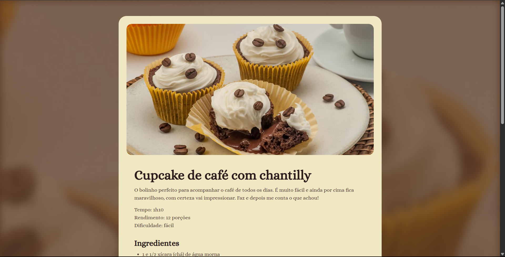

# 🧁 Página de Receita - Cupcake de Café

Este projeto é uma página web responsiva que apresenta uma receita culinária. Foi desenvolvido como parte dos meus estudos em desenvolvimento Web Full-Stack.

  

## 🚀 Tecnologias

Esse projeto foi desenvolvido com as seguintes tecnologias:

- **HTML5** (Uso de tags semânticas como `<main>`, `<section>`, `<ul>`, `<ol>`)
- **CSS3** (Estilização, importação de fontes, variáveis no `:root`)
- **Git e GitHub** (Versionamento de código)

## 💻 Projeto

O objetivo foi criar um layout limpo e legível para uma receita de Cupcake de café com chantilly, aplicando conceitos fundamentais da web:
- Hierarquia de títulos.
- Listas não ordenadas e ordenadas.
- Box Model (padding, margin, border).
- Uso de fontes externas (Google Fonts - Alice).

## 🔗 Acesse o projeto

- Você pode visualizar o layout do projeto aqui:
📲 **[Clique para ver o layout do projeto](https://www.figma.com/community/file/1360315130061454535)**
- Você pode visualizar o site rodando ao vivo clicando aqui:
👉 **[Clique para ver o Site](https://alissonfa.github.io/Receitas/)**

## 📝 Licença

Esse projeto está sob a licença MIT.

---

Feito com 🤎 por **[AlissonFA](https://www.linkedin.com/in/alissonfa/)**.